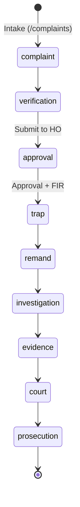

# ACB Trap Case Management — Functional Specification

This document describes the implemented architecture aligning the application with the end-to-end case management functional spec.

## Architecture Overview

The system separates **Workspace modules** (non-linear intelligence engine) from **Case Phase modules** (strict chronological state machine).

## Workspace Modules (Intelligence Engine)

| Route | Module | Behavior |
|-------|--------|----------|
| `/` | Dashboard | Aggregates operational KPIs (active traps, pending HO approvals, conviction rate) + AI pipeline metrics (documents processed/failed) |
| `/complaints` | Complaints | Draft complaint intake with language (EN/TE), DSP assignment, tracking ID generation, case lifecycle initiation via API |
| `/document-processor` | Document Processor | PDF OCR → LLM sub-document extraction → DB + Qdrant embeddings (existing pipeline) |
| `/case-reports` | Case Reports | RAG queries, AI draft generation, manual edit/persist (existing) |
| `/speech-intelligence` | Speech Intelligence | Diarization, transcription, verbatim correction (existing) |
| `/settings` | Settings | AI provider switching (local/cloud), notification thresholds, language preferences (persisted via `/settings` API) |

## Case Phase Modules (State Machine)

Each phase page loads cases filtered by `current_phase` from `GET /workflow/cases?phase={phase}`.

| Route | Phase | Prerequisites | Sub-statuses |
|-------|-------|---------------|--------------|
| `/verification` | verification | complaint complete | pending, in_progress, report_submitted |
| `/approval` | approval | verification | pending, submitted, approved, fir_registered |
| `/trap` | trap | approval + FIR | planning, scheduled, executed |
| `/remand` | remand | trap | pending, diary_generated, custody_active, bail_applied |
| `/investigation` | investigation | remand | active, evidence_collation, charge_sheet_prep |
| `/evidence` | evidence | investigation | logged, secured, archived (sidebar locked until cases reach phase) |
| `/court` | court | evidence | pre_trial, hearing, closed (sidebar locked until cases reach phase) |
| `/prosecution` | prosecution | court | preparing, filed, trial, convicted, acquitted, dismissed |

### State Machine API

- `GET /workflow/cases/{id}` — full workflow state, checkpoints, artifacts, transitions
- `POST /workflow/cases/{id}/transition` — advance phase or update substatus (role-gated)
- `PATCH /workflow/cases/{id}/checkpoints` — toggle phase checkpoints
- `POST /workflow/cases/{id}/approvals` — record HO/FIR approval decisions
- `POST /workflow/cases/{id}/artifacts` — link documents/media to phase

## System Modules

| Route | Module | Status |
|-------|--------|--------|
| `/reports` | Reports Generator | UI catalog (export backend planned) |
| `/administration` | Administration | UI seed (RBAC + audit log schema ready in DB) |

## Database Models

- `complaints` — intake records linked to cases
- `cases` — extended with `current_phase`, `phase_substatus`, `tracking_id`, `language`, `priority`
- `phase_transitions` — immutable transition audit
- `phase_checkpoints` — per-phase checkpoint completion
- `phase_artifacts` — links to documents, media, drafts
- `approvals` — verification/trap/FIR approval records
- `evidence_items` — chain-of-custody registry (schema ready)
- `audit_logs` — system audit trail
- `app_settings` — persisted configuration

## Role-Based Access (Simplified)

Transition permissions enforced in `backend/app/services/workflow.py`:

- **IO**: complaint → verification → trap → remand → investigation → evidence
- **DSP**: verification, approval, investigation
- **HO**: approval, prosecution
- **Admin**: all phases

Full authentication integration is planned; roles are passed via API payload until auth is wired.

## Frontend Integration

- `src/utils/api.js` — centralized API client
- `src/components/PhaseCasesPage.js` — shared phase list + case detail modal
- `src/components/CaseDetailsPanel.js` — loads live workflow, supports checkpoint toggle and phase advance
- `src/layout/Sidebar.js` — dynamic phase locking based on case distribution
